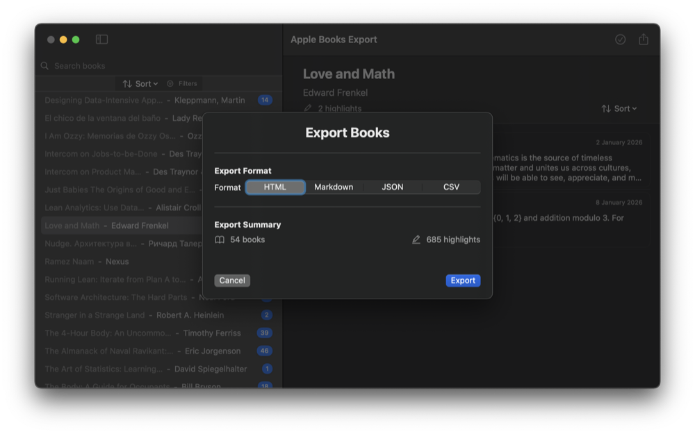
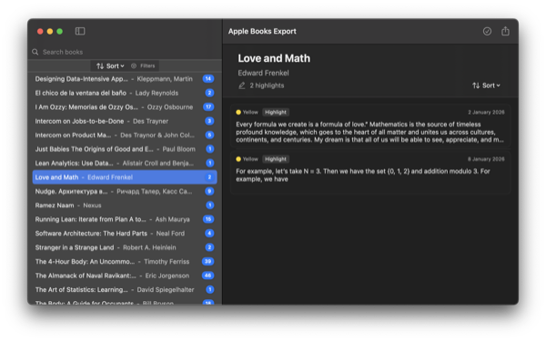
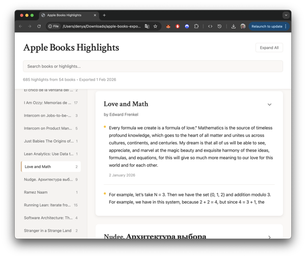

# Apple Books Export

Export your Apple Books highlights, bookmarks, and notes to HTML, Markdown, JSON, or CSV.

[](https://github.com/denya/apple-books-export-macos/releases/download/1.0.0/AppleBooksExport.dmg)
[](https://github.com/denya/apple-books-export-macos)
[](https://swift.org)
[](LICENSE)

## Screenshots

<p align="center">
  
</p>

<p align="center">
  
</p>

<p align="center">
  
</p>

## Features

- Browse your entire Apple Books library with all annotations
- Search and filter by highlight color or annotation type
- Select specific books or individual annotations to export
- Export to HTML (with dark mode), Markdown, JSON, or CSV
- Native macOS app with full keyboard and VoiceOver support

## Install

1. Download the [DMG file](https://github.com/denya/apple-books-export-macos/releases/latest/download/AppleBooksExport.dmg)
2. Drag to Applications
3. Right-click and select "Open" on first launch

Requires macOS 14.0 (Sonoma) or later.

## Export Formats

| Format | Best For |
|--------|----------|
| HTML | Reading and sharing (includes search + dark mode) |
| Markdown | Note-taking apps (Obsidian, Notion, etc.) |
| JSON | Programmatic use and data analysis |
| CSV | Spreadsheets (Excel, Numbers, Google Sheets) |

<details>
<summary><strong>Building from Source</strong></summary>

### Prerequisites

- macOS 14.0+, Xcode 15.0+, Swift 5.9+

### Build

```bash
git clone https://github.com/denya/apple-books-export-macos.git
cd apple-books-export-macos
swift build -c release
```

Or open `Package.swift` in Xcode.

</details>

## Privacy

All data stays on your Mac. Nothing is sent externally.

## License

MIT License - See [LICENSE](LICENSE)

---

Built with [GRDB.swift](https://github.com/groue/GRDB.swift). Not affiliated with Apple Inc.
